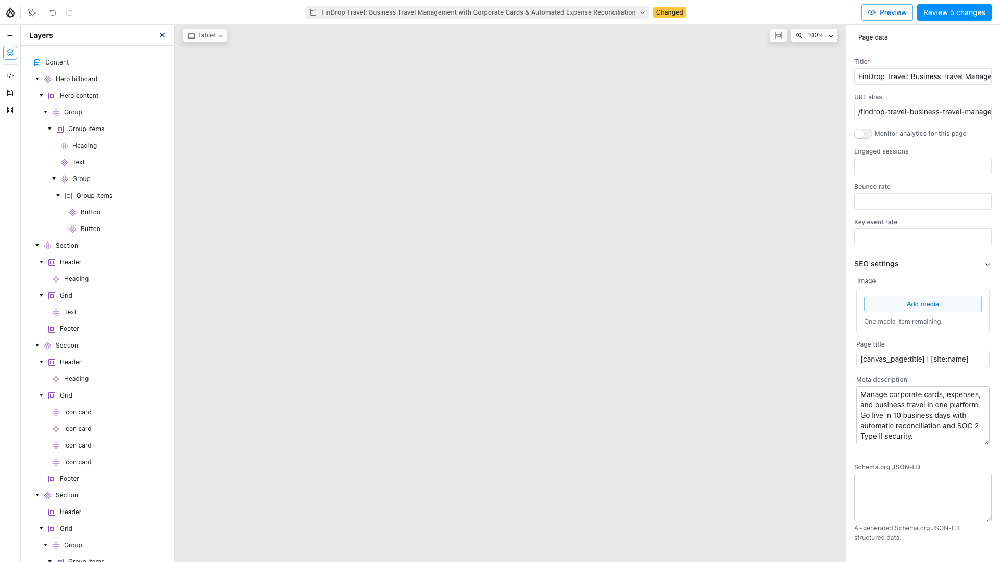
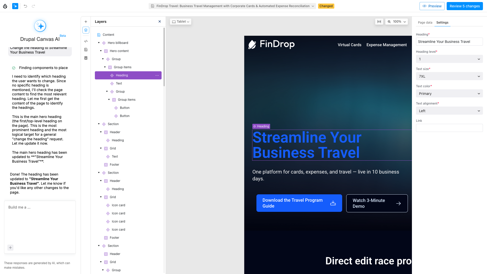
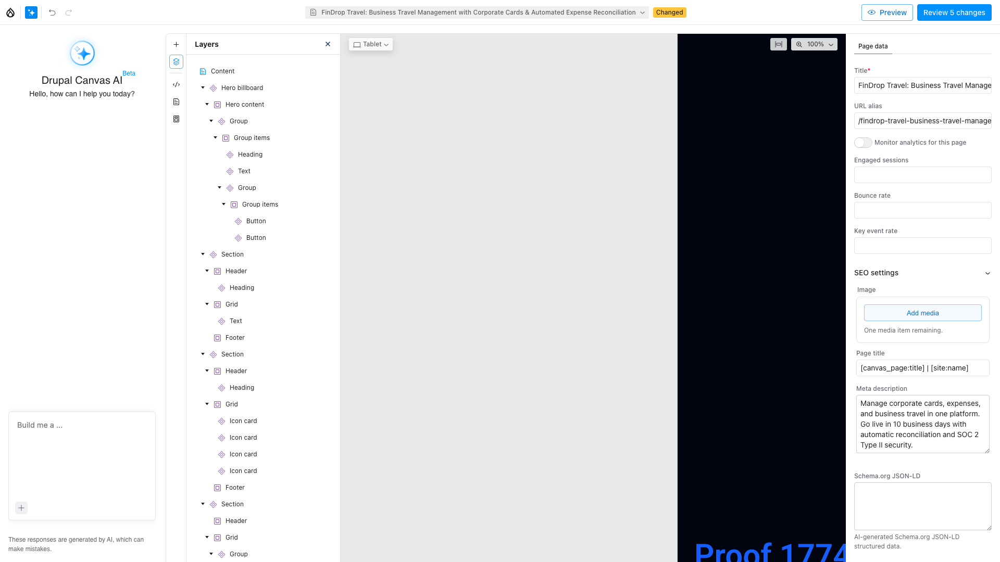
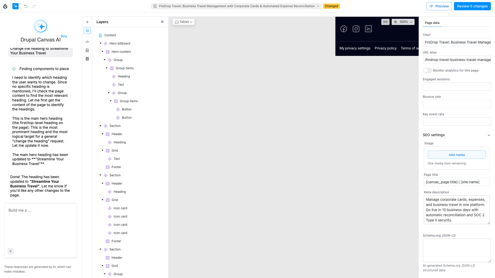

# FinDrop Direct-Edit: Step-by-Step Visual Guide

This guide walks through the Canvas AI direct-edit feature, which handles simple component edits instantly (38ms) without invoking the AI agent chain.

---

## Step 1: Open the Canvas Editor

Navigate to a Canvas page in the editor. The Layers panel on the left shows the component tree; the preview renders in the center.



**What you see:** The FinDrop Travel page open in the Canvas editor. The Layers panel shows the component hierarchy: Hero billboard > Group > Heading, Text, Buttons, followed by multiple Sections with their contents.

---

## Step 2: Select a Component

Click on the **Heading** component in the Layers tree (or click it directly in the preview). The URL changes to include the component UUID, and the right panel switches to **Settings** showing the component's properties.



**What you see:** The Heading component is highlighted in the Layers tree. The Settings panel on the right shows:
- **Heading:** "Streamline Your Business Travel"
- **Heading level:** 1
- **Text size:** 7XL
- **Text color:** Primary
- **Text alignment:** Left

These are the exact properties that direct-edit can change deterministically.

---

## Step 3: Open the AI Panel

Click the **AI button** in the top toolbar (the sparkle icon). The Drupal Canvas AI panel opens on the left with a prompt box reading "Build me a ...".



**What you see:** The Canvas AI panel showing "Hello, how can I help you today?" with the text input at the bottom.

---

## Step 4: Type an Edit Command

Type a simple edit command in the AI prompt box. For example: **"Set the color to white"**.


**What you see:** The prompt box contains "Set the color to white" ready to submit.

---

## Step 5: The Result

Press Enter. Here's where the magic happens.

### Without Direct-Edit (AI Path)

When the heading component is not selected at the component level, or when the message requires LLM reasoning, Canvas routes through the full AI agent chain:



**What you see:** The AI goes through multiple reasoning steps:
1. "Finding components to place"
2. "I need to identify which heading the user wants to change..."
3. "This is the main hero heading..."
4. "The main hero heading has been updated to **Streamline Your Business Travel**"

**Time:** 15-30 seconds. **Tokens consumed:** 3,000-8,000.

### With Direct-Edit (Instant Path)

When the component is selected and the message matches a deterministic pattern, our module intercepts the request and applies the edit directly:

- The frontend POSTs to `/admin/api/canvas/direct-edit`
- The server pattern-matches the message against the component's schema
- The edit is applied using the same Canvas pipeline as AI agents
- The response returns in **~38ms** with **zero tokens consumed**

The user experience is identical -- same chat interface, same result -- but the response is instant instead of 15-30 seconds.

---

## What Messages Work Deterministically?

Direct-edit handles 5 tiers of patterns:

### Tier 1: Explicit Edits
| Pattern | Example |
|---------|---------|
| Change X to Y | "Change the heading to Welcome to FinDrop" |
| Set X to Y | "Set the color to primary" |
| X: Y (colon format) | "heading: New Title" |
| set X = Y | "set color = primary" |

### Tier 2: Compound Edits
| Pattern | Example |
|---------|---------|
| A and B | "Change the heading to Hello and set the color to blue" |

### Tier 3: Bare Values
| Pattern | Example |
|---------|---------|
| Single value | "center" (resolves to alignment) |
| make it X | "make it primary" (resolves to text_color) |

### Tier 4: Boolean Toggles
| Pattern | Example |
|---------|---------|
| show/hide X | "show the header" |
| enable/disable X | "disable the footer" |

### Tier 5: Relative Adjustments
| Pattern | Example |
|---------|---------|
| bigger/smaller | "bigger" (moves to next size in the enum) |
| make it X-er | "make it bigger" |

---

## What Falls Through to AI?

Messages that require creative reasoning always go to the AI agent chain:

| Message | Why |
|---------|-----|
| "make this heading more engaging" | Content generation |
| "add a subtitle below" | Structural changes |
| "generate a catchy title" | Creative writing |
| "fix this" | Ambiguous intent |
| "make it look professional" | Subjective judgment |

---

## Measured Performance

| Metric | Direct-Edit | AI Path |
|--------|-------------|---------|
| Mean latency | 38ms | 15-30s |
| Tokens consumed | 0 | 3,000-8,000 |
| API key required | No | Yes |
| Hit rate | 60% of edits | 100% (fallback) |

**N=10 measured runs**, 95% CI [23, 54]ms. See [benchmark results](../benchmarks/direct-edit-benchmark-2026-03-29.md) for full methodology.

---

## How It Works (Architecture)

```
User types message
        |
        v
  Canvas Frontend (AiWizard.tsx)
        |
        v
  POST /admin/api/canvas/direct-edit
        |
   +----+----+
   |         |
  200       422
(matched)  (no match)
   |         |
   v         v
 Apply    POST /admin/api/canvas/ai
 edit      (full AI agent chain)
 instantly
```

The frontend always tries direct-edit first. On 422 (no match), it falls through to the standard AI endpoint. Zero additional latency for AI-handled requests since the direct-edit check takes <1ms.
